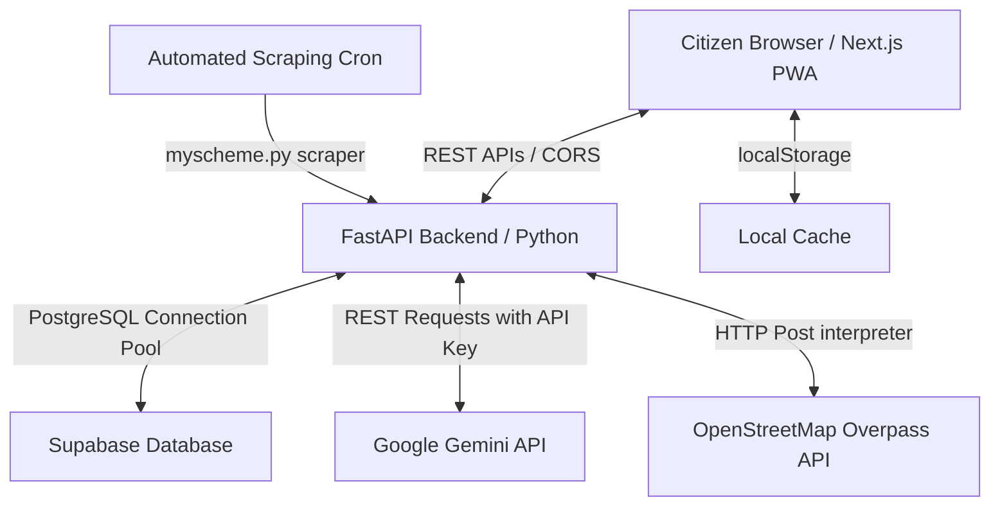

# 🏛️ PROJECT_UNDERSTANDING: "Information Is Wealth"

An in-depth, file-by-file breakdown of the **Information Is Wealth** welfare discovery platform. This document explains the architecture, flow, eligibility rules, and code details across the repository.

---

## Pitch: Pitching to People

When presenting this project to judges, investors, or stakeholders, use this structured framework to highlight the **Problem**, **Solution**, and **Technical Differentiators**.

### 1. The Core Problem Statement
* **Information Fragmentation:** Over 500 central and state welfare schemes exist in India, but their eligibility criteria are buried under complex PDFs, hidden behind scam links, or written in bureaucratic language.
* **The Digital Divide:** The citizens who need these schemes the most (farmers, daily wage workers, rural families) often struggle with text-based inputs, typing in English, or navigating non-responsive sites.
* **Privacy Concerns:** Many platforms require Aadhaar numbers, phone signups, or bank details upfront, raising trust issues and vulnerability to identity scams.

### 2. Our Solution: "Information Is Wealth"
A mobile-first, Progressive Web App (PWA) that acts as a secure, local, and language-agnostic counselor for welfare scheme discovery.
* **Frictionless Entry:** Matches users to schemes in less than 60 seconds with **zero signups** and **zero sensitive data** required.
* **Voice-First Design:** Users can speak their demographics or questions in Tamil, Hindi, or English.
* **Secure & Trustworthy:** All matched scheme links route strictly to official `.gov.in` or `.nic.in` domains.
* **Offline-Resilient:** Operates on flaky 2G networks by falling back to local client memory and client-side database rules.

### 3. Key Technological Differentiators (Why We Stand Out)
* **Local-First Privacy:** Demographics are stored strictly in `localStorage`. They never leave the user's device. No login credentials are required.
* **Hybrid AI RAG Architecture:** The AI assistant uses PGVector and cosine similarity queries to retrieve the top 3 targeted schemes in PostgreSQL. It then feeds them to `gemini-2.5-flash` to generate conversational answers in the user's native language.
* **Live OpenStreetMap Integration:** Queries the **OSM Overpass API** on the fly to get real-world coordinates of post offices and CSCs within 20km of the user, preventing stale directories.

---

## 👥 Real-World User Personas & Use Cases

Here is how different citizens interact with the system and how the underlying features solve their specific challenges.

### Use Case 1: The Voice-Driven Farmer (Multilingual Voice Match)
* **Persona:** *Ramesh*, a 48-year-old farmer from Madurai, Tamil Nadu. He cannot read English and struggles with typing.
* **Workflow:**
  1. Ramesh opens the app and selects Tamil (தமிழ்) on the homepage.
  2. He taps the microphone and says: *"நான் தமிழ்நாட்டில் வசிக்கும் விவசாயி, என் வயது 48"* (I am a farmer living in Tamil Nadu, aged 48).
  3. The **Web Speech API** translates his Tamil voice.
  4. The **Speech Intent Parser** maps keywords (`tamilnadu` ➔ `TN`, `farmer` ➔ `farmer`, `48` ➔ `age: 48`).
  5. The UI automatically generates a matched list of agricultural schemes (such as *PM-KISAN* and Tamil Nadu-specific schemes).
  6. Ramesh clicks **Nearby Centers**, which retrieves his GPS coordinates and shows the nearest *CSC E-Sevai Centre* in Madurai to help him submit his physical files.

### Use Case 2: The College Student (Semantic Search & Deadline Tracker)
* **Persona:** *Priya*, a 19-year-old OBC student in Pune, Maharashtra. She is searching for government funding for her engineering degree.
* **Workflow:**
  1. Priya navigates to **AI Search**.
  2. She types: *"scholarships for engineering college fees for backward classes"*.
  3. The backend runs a **PGVector Semantic Search** comparing her question embedding to scheme text chunks.
  4. It returns the *NSP Post-Matric OBC Scholarship* with a high similarity score.
  5. Priya clicks the scheme, reads the eligibility checklist, and hits **Track Scheme**.
  6. She changes the status to **Applied**, sets a deadline reminder, and notes down her application reference ID. Her dashboard tracks the progress bar from Applied to Approved.

---

## 🎬 Step-by-Step Demo Flow for Judges

Follow this flow to deliver a 3-minute live demonstration:

1. **Step 1: Language Selection & Voice Onboarding (0:00 - 0:45)**
   - Start on the homepage. Change language to Hindi or Tamil to show complete UI localization.
   - Tap the microphone and say: *"I am a student from Tamil Nadu, 19 years old, OBC category"* in English or Tamil. Show the parsed keyword suggestions instantly matching under the voice box.
2. **Step 2: Onboarding & The Match Engine (0:45 - 1:30)**
   - Click the "See My Schemes" button to showcase the profile match engine.
   - Point out the **Specificity Badges** (e.g., matching occupation + income) and show how the system ranks schemes with higher targeted criteria first.
3. **Step 3: Chatting with the AI Counselor (1:30 - 2:15)**
   - Launch the ChatBot drawer. Type a complex query like *"Are there monthly pension schemes for daily wage workers?"*
   - Show how the bot retrieves *PM Shram Yogi Maan-Dhan*, explains the eligibility rules in a conversational tone, warns the user that their data is safe, and provides a direct click button to the official portal.
4. **Step 4: GPS Interactive Locator (2:15 - 2:45)**
   - Click **Nearby Centers** and click **Find Centers Near Me**.
   - Show the interactive Map drawing a user marker and placing blue pins on nearby CSC e-Sevai locations, and rose pins on live India Post offices queried dynamically.
5. **Step 5: Offline Mode Proof (2:45 - 3:00)**
   - Simulate a disconnection. Show that the platform continues to allow profile updates, matches schemes from local cache rules, and loads application tracking notes seamlessly.

---

## 🏗️ Core Architecture & Flow

The application follows a decoupled Client-Server architecture utilizing a Progressive Web App (PWA) on the frontend and a FastAPI service on the backend. It operates in two environments: **Online Mode** (communicating with the FastAPI + Supabase PGVector database) and **Offline-Fallback Mode** (running fully within the client browser memory utilizing local mocks).



### 🔁 Application Lifecycle Flows
1. **Onboarding Flow:**
   - Citizen selects language (English, Tamil, Hindi) on the Home Page (`frontend/app/page.jsx`).
   - Clicking **Get Started** navigates to `frontend/app/onboarding/page.jsx`, which prompts for 6 attributes: State, Gender, Caste/Category, Age, Annual Income, and Occupation.
   - The profile is stored inside the browser's `localStorage` (under the key `user_profile`) to keep it private and offline-safe.
2. **Scheme Discovery Flow:**
   - Navigating to `/schemes` triggers a request to the backend `/schemes/match` with the local profile.
   - If PostgreSQL is online, it loads all schemes and runs the demographic match logic.
   - If PostgreSQL is offline, it falls back to mock schemes defined in `fallback_data.py`.
   - Matching schemes are sorted by demographic specificity first, followed by benefit amount.
3. **Application Tracking Flow:**
   - From any scheme's detail page, citizens can save it.
   - The `tracker` page (`frontend/app/tracker/page.jsx`) lists saved schemes from local storage (`tracked_schemes`), allowing citizens to log notes, modify statuses (Saved, Applied, Under Review, Approved, Rejected), and set deadlines.
4. **Assistance Centers Locator Flow:**
   - The `/nearby` page (`frontend/app/nearby/page.jsx`) requests the user's GPS coordinates.
   - It makes an API call to the backend `/centers/nearby` route.
   - The backend checks for nearby CSCs and post offices using haversine earth distance, queries live OpenStreetMap (OSM) Overpass API nodes inside 20km for real post offices, merges results, deduplicates close coords, and returns them to be plotted on an interactive Leaflet Map.
5. **AI Counselor Conversation Flow:**
   - The AI assistant ChatBot drawer (`frontend/components/ChatBot.jsx`) accepts free-text queries.
   - It calls `/chat`, which converts the query into a vector embedding via Gemini (`gemini-embedding-001`).
   - It runs a cosine similarity query (`<=>` operator) against PostgreSQL's `embedding` column to retrieve the top 3 semantically matching schemes.
   - A detailed prompt including the context of these 3 schemes and the user's demographic profile is sent to `gemini-2.5-flash`.
   - The response is displayed alongside clickable suggestion buttons for matched schemes.

---

## 📂 Complete File-by-File Breakdown

### 📁 Root Directory
* **[Readme.md](file:///c:/Users/kanak/Coding/club/Government-Welfare-Scheme/Readme.md)**
  * Contains deployment instructions, local setup guidelines, prerequisite listings, API endpoints table, database setup explanations, and acknowledges sources like `myscheme.gov.in`.
* **[database_setup.sql](file:///c:/Users/kanak/Coding/club/Government-Welfare-Scheme/database_setup.sql)**
  * The PostgreSQL database migration script. Creates the `schemes` table with a `vector` data type column (768 dimensions for Gemini embeddings) using the `pgvector` extension.
  * Creates the `centers` table to store Common Service Centers (CSCs) and post offices, indexing them by latitude and longitude.
* **[start.bat](file:///c:/Users/kanak/Coding/club/Government-Welfare-Scheme/start.bat) & [start.sh](file:///c:/Users/kanak/Coding/club/Government-Welfare-Scheme/start.sh)**
  * One-click platform orchestrator scripts. Creates the Python virtual environment (`venv`), installs backend `requirements.txt`, installs frontend packages, and launches both Next.js (`port 3000`) and FastAPI (`port 8000`) concurrently.

---

### 📁 Backend (`backend/`)
* **[app_main.py](file:///c:/Users/kanak/Coding/club/Government-Welfare-Scheme/backend/app_main.py)**
  * FastAPI server entry point. Loads environmental config, sets up CORS middleware to whitelist the Next.js port, declares database lifespan hooks, and mounts routers for health, schemes, chat, and centers.
* **[database.py](file:///c:/Users/kanak/Coding/club/Government-Welfare-Scheme/backend/database.py)**
  * Sets up the asynchronous PostgreSQL connection pool using `asyncpg`. Exposes `connect_db()`, `disconnect_db()`, and `get_pool()`.
* **[requirements.txt](file:///c:/Users/kanak/Coding/club/Government-Welfare-Scheme/backend/requirements.txt)**
  * Python dependencies: `fastapi`, `uvicorn`, `asyncpg`, `httpx`, `beautifulsoup4`, `pydantic`, `python-dotenv`.
* **[smoke_test.py](file:///c:/Users/kanak/Coding/club/Government-Welfare-Scheme/backend/smoke_test.py)**
  * Verifies database connections, runs test API fetches, and checks models.

#### 📁 Models (`backend/models/`)
* **[scheme.py](file:///c:/Users/kanak/Coding/club/Government-Welfare-Scheme/backend/models/scheme.py)**
  * Pydantic schemas validating user profile parameters (e.g., State, Gender, Caste, Age, Income, Occupation) and match requests.
* **[chat.py](file:///c:/Users/kanak/Coding/club/Government-Welfare-Scheme/backend/models/chat.py)**
  * Pydantic schemas validating AI chat payloads (containing query text, history list, and user profile metadata).

#### 📁 Routers (`backend/routers/`)
* **[health.py](file:///c:/Users/kanak/Coding/club/Government-Welfare-Scheme/backend/routers/health.py)**
  * Exposes GET `/health` endpoint to test database connection pool responsiveness.
* **[schemes.py](file:///c:/Users/kanak/Coding/club/Government-Welfare-Scheme/backend/routers/schemes.py)**
  * Declares endpoints for matching, searching, detailed retrieval, scraping triggers, and explaining eligibility:
    * `POST /match`: Matches profile attributes against active schemes.
    * `GET /search`: Returns string matching results using SQL `ILIKE`.
    * `GET /semantic-search`: Vector search matching schemes using PGVector.
    * `POST /check/{id}`: Explains profile mismatch rules for specific schemes.
    * `POST /sync-scraped`: Triggers background pipeline scraping.
* **[chat.py](file:///c:/Users/kanak/Coding/club/Government-Welfare-Scheme/backend/routers/chat.py)**
  * Implements RAG chat. Connects to `gemini.py` services to fetch query embeddings, runs similarity calculations to identify related schemes, formats constraints, and queries Gemini for answers in Tamil, Hindi, or English.
* **[centers.py](file:///c:/Users/kanak/Coding/club/Government-Welfare-Scheme/backend/routers/centers.py)**
  * Manages CSCs and Post Office assistance directories.
    * `POST /`: Adds custom centers to the database.
    * `GET /nearby`: Queries coordinates against database tables, falls back to static arrays if offline, pulls live post offices from the OSM Overpass API, merges lists, and deduplicates markers.

#### 📁 Services (`backend/services/`)
* **[matcher.py](file:///c:/Users/kanak/Coding/club/Government-Welfare-Scheme/backend/services/matcher.py)**
  * Houses core boolean logic deciding scheme eligibility. Also builds granular reasons for failure (e.g., "Minimum age required is 18 years") if mismatch check occurs.
* **[fallback_data.py](file:///c:/Users/kanak/Coding/club/Government-Welfare-Scheme/backend/services/fallback_data.py)**
  * Hardcoded fallback datasets for schemes and centers to run the platform when PostgreSQL database connections fail. Includes haversine distance arithmetic.
* **[gemini.py](file:///c:/Users/kanak/Coding/club/Government-Welfare-Scheme/backend/services/gemini.py)**
  * Communicates with Google's generative models (`gemini-embedding-001` and `gemini-2.5-flash`) via direct REST client calls. Builds dense context metadata strings from scheme columns for embedding indexing.
* **[pipeline.py](file:///c:/Users/kanak/Coding/club/Government-Welfare-Scheme/backend/services/pipeline.py)**
  * Scraping orchestrator. Invokes scrapers, runs SQL `INSERT` commands, checks conflicts, and updates the database with new embeddings.

#### 📁 Scrapers (`backend/scrapers/`)
* **[myscheme.py](file:///c:/Users/kanak/Coding/club/Government-Welfare-Scheme/backend/scrapers/myscheme.py)**
  * A web scraper parsing `myscheme.gov.in` structure to extract scheme names, descriptions, and eligibility attributes.
* **[import_to_db.py](file:///c:/Users/kanak/Coding/club/Government-Welfare-Scheme/backend/scrapers/import_to_db.py)**
  * Script to populate initial schemas and mock schemes into Supabase.

---

### 📁 Frontend (`frontend/`)

#### 📁 App Routing Pages (`frontend/app/`)
* **[layout.jsx](file:///c:/Users/kanak/Coding/club/Government-Welfare-Scheme/frontend/app/layout.jsx) & [globals.css](file:///c:/Users/kanak/Coding/club/Government-Welfare-Scheme/frontend/app/globals.css)**
  * Sets up responsive viewport tags, global typography, and base CSS variables.
* **[page.jsx](file:///c:/Users/kanak/Coding/club/Government-Welfare-Scheme/frontend/app/page.jsx)**
  * Welcome screen featuring voice dictation input (Web Speech API). Parses spoken words to automatically construct profile attributes and matches schemes.
* **[onboarding/page.jsx](file:///c:/Users/kanak/Coding/club/Government-Welfare-Scheme/frontend/app/onboarding/page.jsx)**
  * Multi-step wizard collecting State, Gender/Caste, Age, Income, and Occupation. Saves profiles to `localStorage` before redirecting to `/schemes`.
* **[schemes/page.jsx](file:///c:/Users/kanak/Coding/club/Government-Welfare-Scheme/frontend/app/schemes/page.jsx)**
  * Renders matching results. Includes filter menus for benefit types and states, search bars, and specificity badges.
* **[schemes/\[id\]/page.jsx](file:///c:/Users/kanak/Coding/club/Government-Welfare-Scheme/frontend/app/schemes/[id]/page.jsx)**
  * Displays details for a single scheme (ministry, benefits, required documents, official links). Shows mismatch reasons if the user profile is ineligible.
* **[search/page.jsx](file:///c:/Users/kanak/Coding/club/Government-Welfare-Scheme/frontend/app/search/page.jsx)**
  * Contains text search and semantic PGVector search inputs.
* **[tracker/page.jsx](file:///c:/Users/kanak/Coding/club/Government-Welfare-Scheme/frontend/app/tracker/page.jsx)**
  * Application Tracker dashboard. Allows saving schemes, updating statuses, editing logs, and calculating days left until deadlines.
* **[nearby/page.jsx](file:///c:/Users/kanak/Coding/club/Government-Welfare-Scheme/frontend/app/nearby/page.jsx)**
  * Locator dashboard. Coordinates GPS queries, manually overrides city nodes, displays post office detail lists, and links to Google Directions.
* **[profile/page.jsx](file:///c:/Users/kanak/Coding/club/Government-Welfare-Scheme/frontend/app/profile/page.jsx)**
  * View, update, or clear local profile details.

#### 📁 Components (`frontend/components/`)
* **[AppLayout.jsx](file:///c:/Users/kanak/Coding/club/Government-Welfare-Scheme/frontend/components/AppLayout.jsx)**
  * Top navigation header (desktop) and footer bottom-bar navigation (mobile). Implements responsive layout views.
* **[ChatBot.jsx](file:///c:/Users/kanak/Coding/club/Government-Welfare-Scheme/frontend/components/ChatBot.jsx)**
  * Handles the floating launcher widget and sliding conversation overlay. Connects to backend `/chat` endpoints and lists clickable scheme suggestion buttons returned by Gemini.
* **[MapComponent.jsx](file:///c:/Users/kanak/Coding/club/Government-Welfare-Scheme/frontend/components/MapComponent.jsx)**
  * Renders an interactive map using Leaflet. Plots user markers, assistance center pins, and location overlays.

---

## 🏛️ Key Database Principle: "NULL = Universal"

To handle a large number of schemes efficiently, the database schema uses a **NULL = Universal** design principle:
* If a filter column (e.g., `applicable_states`, `gender`, `caste_categories`, `occupation_types`, `max_income`) contains a `NULL` value, it means there are **no restrictions** on that dimension.
* This keeps database storage clean and ensures schemes apply universally unless specific constraints are defined.

For example, a national scheme open to all farmers in India will be stored as:
* `applicable_states = NULL` (Applies to all states)
* `gender = NULL` (Applies to all genders)
* `occupation_types = ['farmer']` (Restricted to farmers)
* `max_income = NULL` (No income limit)

---

## ⚙️ Matching Logic Algorithm

The matching logic evaluates a user's profile against scheme eligibility criteria. Below is the matching algorithm implemented in Python (`matcher.py`):

```python
def is_eligible(user: UserProfile, scheme: dict) -> bool:
    # State check — if scheme has states listed, user must be in one of them or 'All'
    if scheme["applicable_states"] is not None:
        if user.state not in scheme["applicable_states"] and "All" not in scheme["applicable_states"]:
            return False

    # Gender check
    if scheme["gender"] is not None:
        if user.gender != scheme["gender"] and scheme["gender"] != "any":
            return False

    # Caste check — user must match at least one listed caste category or 'All'
    if scheme["caste_categories"] is not None:
        if user.caste_category not in scheme["caste_categories"] and "All" not in scheme["caste_categories"]:
            return False

    # Age checks (independent min and max boundaries)
    if scheme["min_age"] is not None and user.age < scheme["min_age"]:
        return False
    if scheme["max_age"] is not None and user.age > scheme["max_age"]:
        return False

    # Income check — user's income must be at or below max allowed
    if scheme["max_income"] is not None and user.income_annual > scheme["max_income"]:
        return False

    # Occupation check — user must match at least one listed type
    if scheme["occupation_types"] is not None:
        if user.occupation_type not in scheme["occupation_types"] and "All" not in scheme["occupation_types"]:
            return False

    return True
```
