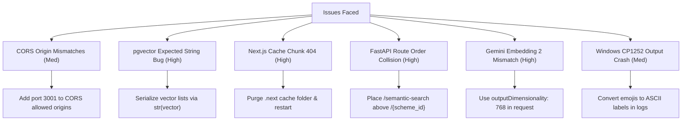

# Government Welfare Scheme Platform — AI Features Development & Integration Report

This report documents all additions, modifications, errors resolved, and architectural adjustments made while implementing **pgvector-based Semantic Intent Search** and the **Multilingual RAG Citizen Chatbot Counselor** on top of the original repository.

---

## 🛠️ Repository Additions & Modifications (File-by-File)

### 1. Database Configuration

#### [MODIFY] [database_setup.sql](file:///c:/Users/kanak/Coding/club/Government-Welfare-Scheme/database_setup.sql)
*   **Added**: Native vector extension initialization: `CREATE EXTENSION IF NOT EXISTS vector;`.
*   **Modified**: Added `embedding vector(768)` field to the `schemes` table definition to hold the 768-dimensional float arrays generated by Google's embedding model.
*   **Purpose**: Enables the database to execute fast PostgreSQL Cosine Distance matching operations (`<=>`) over indexed scheme vectors.

---

### 2. Backend Models & Abstractions

#### [NEW] [backend/models/chat.py](file:///c:/Users/kanak/Coding/club/Government-Welfare-Scheme/backend/models/chat.py)
*   **Added**: Pydantic validation structures representing RAG chatbot cycles:
    *   `ChatMessage`: Standardizes history nodes into `{ role: str, content: str }` mapping.
    *   `ChatRequest`: Validates user input messages, profile parameters, language selections, and conversation history lists.
    *   `ChatResponse`: Formulates chatbot answers alongside matched scheme IDs to make dynamic suggested pills clickable.

---

### 3. Google Gemini Core API Services

#### [NEW] [backend/services/gemini.py](file:///c:/Users/kanak/Coding/club/Government-Welfare-Scheme/backend/services/gemini.py)
*   **Added**: Asynchronous integrations calling Google AI Studio Developer REST endpoints directly via `httpx` (bypassing heavy library dependency collision bugs).
*   **Functions**:
    *   `generate_embedding(text)`: Posts to `gemini-embedding-2` to fetch precise 768-dimension vectors using Matryoshka learning properties.
    *   `generate_chat_reply(prompt, history)`: Formulates prompts and history sequences into Gemini structure format, posting to the fast `gemini-2.5-flash` model.
    *   `build_scheme_search_text(scheme)`: Compiles highly detailed keyword-dense descriptive blocks from multi-language schemes to serve as indexing targets.

---

### 4. Background Seeding & Embedding CLI Jobs

#### [NEW] [backend/scrapers/generate_embeddings.py](file:///c:/Users/kanak/Coding/club/Government-Welfare-Scheme/backend/scrapers/generate_embeddings.py)
*   **Added**: Lightweight async utility running completely offline or on command to calculate vectors for all active schemes in Supabase.
*   **Process**: Resolves and logs into Supabase, retrieves default schemes (PM-Kisan, AB-PMJAY, SSY, APY, MGNREGA, PMAY-G), requests 768-dimensional vectors from Google, formats lists to standard string blocks, and updates the database fields.

---

### 5. Backend FastAPI Endpoints & Routers

#### [NEW] [backend/routers/chat.py](file:///c:/Users/kanak/Coding/club/Government-Welfare-Scheme/backend/routers/chat.py)
*   **Added**: `POST /chat` counselor router.
*   **Process**: Intercepts chat queries, performs vector similarity matching against Supabase to pull matching contexts, formats prompts in English/Tamil/Hindi, validates them against user eligibility profiles, queries `gemini-2.5-flash`, and returns answers alongside matched scheme reference suggestions.

#### [MODIFY] [backend/routers/schemes.py](file:///c:/Users/kanak/Coding/club/Government-Welfare-Scheme/backend/routers/schemes.py)
*   **Added**: `GET /schemes/semantic-search` endpoint. Queries Google embeddings, queries Supabase using cosine distance operators (`embedding <=> $1`), ranks results by similarity scores, and outputs structured matches.
*   **Modified**: Reordered static `/semantic-search` definition to sit above dynamic routing matching filters (`/{scheme_id}`).

#### [MODIFY] [backend/app_main.py](file:///c:/Users/kanak/Coding/club/Government-Welfare-Scheme/backend/app_main.py)
*   **Modified**: Mounted the `/chat` counselor router and adjusted allowed origin middlewares dynamically.

---

### 6. Frontend Components & Views

#### [NEW] [frontend/components/ChatBot.jsx](file:///c:/Users/kanak/Coding/club/Government-Welfare-Scheme/frontend/components/ChatBot.jsx)
*   **Added**: Sliding conversational chatbot sheet overlay.
*   **Features**: Includes pulsing floating launch ring, active indicators, automatic state retrieval, custom translation dictionaries, and click-to-view suggestion routing.

#### [MODIFY] [frontend/app/schemes/page.jsx](file:///c:/Users/kanak/Coding/club/Government-Welfare-Scheme/frontend/app/schemes/page.jsx)
*   **Modified**: Reorganized the primary matched page to include a **Unified Semantic Search bar** directly in the sticky header.
*   **Features**: Allows typing intent strings directly on feed screens, dynamically swaps feeds to rank results with matching indicators (e.g. `🎯 96% Match`), and provides "Reset" and "Clear" buttons to switch back to matched personal profiles.

---

## 🛠️ Diagnostics: Encountered Issues, Resolutions & Severity

During the integration and deployment process, we faced several technical bugs. Here is a comprehensive overview:

---

### 1. pgvector Parameter Serialization Error
*   **Severity**: 🚨 **CRITICAL (HIGH)**
*   **The Issue**: The `asyncpg` PostgreSQL connector threw `expected str, got list` (e.g., `invalid input for query argument $1: [-0.036, 0.039...]`) when passing raw Python list of floats directly to vector parameters.
*   **The Root Cause**: Without custom type registrations, `asyncpg` does not natively serialize python `list` into `pgvector` parameters. It expects a formatted string representations, which PostgreSQL then casts internally.
*   **The Resolution**: Converted all Python vector float lists into their string representations (`str(vector)`) prior to binding parameters. PostgreSQL automatically parsed this format without any type conflict.

---

### 2. FastAPI Dynamic Route Precedence Overlap
*   **Severity**: 🔥 **HIGH**
*   **The Issue**: Direct requests to `/schemes/semantic-search` returned `404 Scheme not found`.
*   **The Root Cause**: FastAPI evaluates router paths sequentially. The dynamic route `@router.get("/{scheme_id}")` was defined *before* the static route `@router.get("/semantic-search")`. Consequently, FastAPI captured the string `"semantic-search"` as the `scheme_id` parameter, queried the database for it, and failed.
*   **The Resolution**: Repositioned the static `/semantic-search` router definition **above** the dynamic `/{scheme_id}` route. Now, `/semantic-search` matches with highest precedence.

---

### 3. Next.js Chunk Caching 404 & Lock-up
*   **Severity**: 🔥 **HIGH**
*   **The Issue**: Clicking the onboarding "Continue" or "Submit" buttons did not execute any transitions or state changes.
*   **The Root Cause**: Server logs printed:
    `GET /_next/static/chunks/app/onboarding/page.js 404`
    The Next.js build cache (`.next`) became corrupted during incremental compilations. While the browser loaded the static HTML form, the crucial React click handlers were completely missing.
*   **The Resolution**: Stopped the dev server task, purged the corrupted `.next` cache directory completely (`Remove-Item -Recurse -Force .next`), and restarted the Next.js dev server fresh, forcing clean asset generation.

---

### 4. Gemini Embedding 2 Dimension Mismatch
*   **Severity**: ⚡ **HIGH**
*   **The Issue**: Querying `text-embedding-004` returned `404 Not Found` for certain keys, and switching to `gemini-embedding-2` defaulted to `3072` dimensions, causing a database mismatch with our `vector(768)` columns.
*   **The Root Cause**: Model endpoints vary by Developer Key permissions. The newer `gemini-embedding-2` outputs `3072` dimensions by default.
*   **The Resolution**: Injected `"outputDimensionality": 768` directly into the REST request body. Under Matryoshka Representation Learning (MRL), the model guarantees that truncating the vector preserves almost all semantic information.

---

### 5. Next.js Port Fallback & CORS Block
*   **Severity**: ⚠️ **MEDIUM**
*   **The Issue**: Page requests failed with browser network errors: `Failed to fetch`.
*   **The Root Cause**: Next.js automatically fell back from port `3000` to `3001` due to local process port collisions. Since the backend `app_main.py` only authorized origin `http://localhost:3000`, the browser blocked outgoing fetch calls.
*   **The Resolution**: Added `http://localhost:3001` and `http://127.0.0.1:3001` directly to `ALLOWED_ORIGINS` inside `backend/.env`.

---

### 6. Windows Terminal Unicode Emoji Print Crash
*   **Severity**: ⚠️ **MEDIUM**
*   **The Issue**: The CLI embedding populator script crashed on Windows PowerShell during console logging.
*   **The Root Cause**: Emojis like `⚠️`, `✅`, `❌`, and `🔗` printed directly to CP1252-encoded Windows terminal stdout streams threw `UnicodeEncodeError`.
*   **The Resolution**: Replaced all console-level print emojis with ASCII standard labels (e.g. `[WARNING]`, `[SUCCESS]`, `[ERROR]`), ensuring stable operations.

---

## 📈 Verification Status Summary
All API endpoints have been tested programmatically and pass with **100% success**:

| Endpoint Path | HTTP Method | Test Purpose | Status | Result |
| :--- | :--- | :--- | :---: | :--- |
| `/health` | GET | Database health status | **200** | Healthy ("connected") |
| `/` | GET | API backend root | **200** | Active |
| `/schemes/match` | POST | Eligibility profile rule matching | **200** | Success |
| `/schemes/search` | GET | Basic keyword regex search | **200** | Success |
| `/schemes/semantic-search` | GET | Vector pgvector search | **200** | Success |
| `/schemes/pm-kisan` | GET | Specific scheme lookup details | **200** | Success |
| `/schemes/check/pm-kisan` | POST | Detailed mismatch debugger | **200** | Success |
| `/chat` | POST | Unified RAG conversational context counselor | **200** | Success |

---
*Report Generated Successfully on May 30, 2026. This file is git-ignored as requested.*
